```text
  ____ _ _   _          
 / ___(_) |_| |_ __ _   
| |  _| | __| __/ _` |  
| |_| | | |_| || (_| |  
 \____|_|\__|\__\__,_|  Git Task Assistant
```
<div align="center">

Your tasks live where your code lives. The Local-First, Git-Native Agile tool for hackers.

</div>

[English](README.md) | [中文](README.zh-CN.md)

[](https://github.com/GavinWu1991/gitta/actions/workflows/ci.yml)
[](LICENSE)
[](go.mod)

---

## Core Demo


See Gitta in action: create a task, start working on it, and watch status update automatically based on your Git workflow.

---

## Architecture



```mermaid
graph LR
    subgraph "Local Environment"
        Dev[👨‍💻 Developer]
        
        subgraph "Gitta Core"
            Engine[⚙️ Gitta Engine]
        end
        
        subgraph "File System"
            MD[📄 Markdown Tasks]
            Git[.git Directory]
        end
    end

    Dev -->|gitta start| Engine
    Dev -->|gitta list| Engine
    
    Engine -->|Read/Write| MD
    Engine -->|Check Branch/Commit| Git
    
    MD -.->|Define| Scope
    Git -.->|Determine| Status
    
    Scope & Status -->|Computed State| Engine
```

Gitta acts as a bridge between your Markdown task files and Git repository state, automatically deriving task status from branch operations.

---

## Workflow


Task status flows automatically with your Git operations—no manual updates required.

---

## Use Cases

### The "Flow" Mode

You want to fix a bug without leaving your terminal.

```bash
$ gitta story create --title "Fix NPE in user service"
$ gitta start US-001
```

🚀 Branch created. Context switched. Start coding immediately.

### The "Standup" Mode

You need to answer "What did you do yesterday?"

```bash
$ gitta list --all
```

📋 See all your tasks with their current status, derived automatically from Git branch state.

---

## Table of Contents

- [Core Demo](#core-demo)
- [Architecture](#architecture)
- [Workflow](#workflow)
- [Use Cases](#use-cases)
  - [The "Flow" Mode](#the-flow-mode)
  - [The "Standup" Mode](#the-standup-mode)
- [Table of Contents](#table-of-contents)
- [What is Gitta?](#what-is-gitta)
  - [Features](#features)
- [Quick Start](#quick-start)
  - [Prerequisites](#prerequisites)
  - [Download Pre-built Binaries](#download-pre-built-binaries)
  - [Installation](#installation)
  - [One-line install + init (auto-download + init script)](#one-line-install--init-auto-download--init-script)
  - [Build](#build)
  - [First Commands](#first-commands)
- [Available Commands](#available-commands)
  - [Quick Examples](#quick-examples)
- [Common Workflows](#common-workflows)
  - [Getting Started (Install → List → Start → Verify)](#getting-started-install--list--start--verify)
  - [Daily Flow (Pull → List → Start/Continue → Review)](#daily-flow-pull--list--startcontinue--review)
  - [Sprint Planning (Sprint vs Backlog)](#sprint-planning-sprint-vs-backlog)
  - [Sprint Management](#sprint-management)
- [Architecture](#architecture-1)
- [Development](#development)
  - [Project Structure](#project-structure)
  - [Tests](#tests)
  - [Adding New Commands](#adding-new-commands)
- [Contributing](#contributing)
- [Documentation](#documentation)
- [Support](#support)
- [License](#license)

---

## What is Gitta?

Gitta is a Git Task Assistant that stores tasks as Markdown files inside your repo. It derives status from Git branches, so your Sprint and backlog stay in sync with your actual work. No servers, no extra services—just Git.

### Features

- **Zero Infrastructure**: Nothing to provision; works in any Git repo.
- **Git-Native**: Tasks live as Markdown with YAML frontmatter.
- **Branch-Aware**: Branch state drives task status automatically.
- **Sprint Management**: Organize tasks by time-bounded sprints with burndown charts.
- **Visual Status Indicators**: Sprint status shown via folder name prefixes (! Active, + Ready, @ Planning, ~ Archived) that auto-sort in file managers.
- **Self-Healing**: `doctor` command detects and repairs inconsistencies between visual indicators and status files.
- **CLI-First**: Fast command-line workflow with interactive TUI for task selection.
- **Offline-First**: Works entirely offline after setup.

---

## Quick Start

### Prerequisites

- Go 1.21 or higher
- Git
- Make (optional, for development)

### Download Pre-built Binaries

> Recommended: fastest path (≈2 minutes), no Go toolchain required.

1. Visit GitHub Releases and choose a version.  
2. Download the archive for your platform:  
   - macOS: `gitta-<version>-darwin-amd64.tar.gz` (Intel) or `darwin-arm64.tar.gz` (Apple Silicon)  
   - Linux: `gitta-<version>-linux-amd64.tar.gz` or `linux-arm64.tar.gz`  
   - Windows: `gitta-<version>-windows-amd64.zip` or `windows-amd64.zip`
3. Verify integrity (recommended):  
   ```bash
   shasum -a 256 gitta-<version>-<platform>-<arch>.tar.gz
   # Compare with checksums.txt from the release
   ```
4. Extract and put on PATH:  
   ```bash
   tar -xzf gitta-<version>-darwin-amd64.tar.gz   # macOS/Linux
   unzip gitta-<version>-windows-amd64.zip        # Windows
   sudo mv gitta /usr/local/bin/                  # optional
   gitta --help
   ```

### Installation

```bash
# Clone the repository
git clone https://github.com/GavinWu1991/gitta.git
cd gitta

# Install dependencies
go mod tidy

# Verify installation
make verify  # Run all checks
```

### One-line install + init (auto-download + init script)

```bash
curl -sSf https://raw.githubusercontent.com/GavinWu1991/gitta/main/scripts/remote-init.sh | bash
# Force re-init or custom sprint name:
curl -sSf https://raw.githubusercontent.com/GavinWu1991/gitta/main/scripts/remote-init.sh | bash -s -- --force --example-sprint Sprint-02
```

### Build

```bash
# Build the binary
go build -o gitta ./cmd/gitta

# Verify it works
./gitta --help
./gitta version
```

### First Commands

```bash
# Initialize workspace (creates sprints/backlog + examples)
gitta init

# List current Sprint tasks
gitta list

# List all tasks (Sprint + Backlog)
gitta list --all

# Start working on a task
gitta start US-001

# Create a new story
gitta story create --title "Implement feature X"

# Update story status
gitta story status US-001 --status doing

# Move story to sprint
gitta story move US-001 --to sprints/2025-01/

# List with filters
gitta list --status doing --priority high

# Check version
gitta version
```

---

## Available Commands

| Command | Description | Basic Usage | Docs |
|---------|-------------|-------------|------|
| `gitta init` | Initialize gitta workspace with example tasks | `gitta init [--force] [--example-sprint <name>]` | [docs/cli/init.md](docs/cli/init.md) |
| `gitta list` | Show current Sprint tasks; `--all` includes backlog; supports filtering | `gitta list [--all] [--status <status>] [--priority <priority>]` | [docs/cli/list.md](docs/cli/list.md) |
| `gitta sprint start` | Create and activate a new sprint, or activate existing sprint | `gitta sprint start [sprint-id] [--duration <duration>]` | [docs/cli/sprint.md](docs/cli/sprint.md) |
| `gitta sprint plan` | Create a new planning sprint for future work | `gitta sprint plan <name> [--id <id>]` | [docs/cli/sprint.md](docs/cli/sprint.md) |
| `gitta sprint close` | Close sprint and rollover unfinished tasks | `gitta sprint close [--target-sprint <name>] [--all]` | [docs/cli/sprint.md](docs/cli/sprint.md) |
| `gitta sprint burndown` | Generate burndown chart from Git history | `gitta sprint burndown [name] [--format <format>]` | [docs/cli/sprint.md](docs/cli/sprint.md) |
| `gitta doctor` | Detect and repair sprint status inconsistencies | `gitta doctor [--fix] [--sprint <name>]` | [docs/cli/sprint.md](docs/cli/sprint.md) |
| `gitta start` | Create/check out feature branch for a task, optionally set assignee | `gitta start <task-id|file-path> [--assignee <name>]` | [docs/cli/start.md](docs/cli/start.md) |
| `gitta story create` | Create a new story with unique ID and open editor | `gitta story create --title "Title" [--prefix US]` | [docs/cli/create.md](docs/cli/create.md) |
| `gitta story status` | Update story status atomically | `gitta story status <story-id> --status <status>` | [docs/cli/status.md](docs/cli/status.md) |
| `gitta story move` | Move story file to different directory atomically | `gitta story move <story-id> --to <dir>` | [docs/cli/move.md](docs/cli/move.md) |
| `gitta version` | Report build metadata (semver, commit, build date, Go version) | `gitta version [--json]` | [docs/cli/version.md](docs/cli/version.md) |

### Quick Examples

```bash
# Sprint tasks only
gitta list

# Sprint + backlog
gitta list --all

# Start by task ID
gitta start US-001

# Start by file path
gitta start sprints/Sprint-01/US-001.md

# Check version
gitta version --json
```

---

## Common Workflows

### Getting Started (Install → List → Start → Verify)
1) Install and build (see Quick Start)  
2) View Sprint tasks: `gitta list`  
3) Start a task: `gitta start US-001`  
4) Verify branch and status: check Git branch and task frontmatter

### Daily Flow (Pull → List → Start/Continue → Review)
1) Update repo: `git pull`  
2) View Sprint: `gitta list`  
3) Start or continue a task: `gitta start <task-id>`  
4) Commit/push as you progress; use branches to reflect status

### Sprint Planning (Sprint vs Backlog)
1) List Sprint only: `gitta list`  
2) Review Sprint + backlog: `gitta list --all`  
3) Move tasks between Sprint/backlog by editing Markdown locations; rerun `gitta list --all` to verify

### Sprint Management
1) Start a new sprint: `gitta sprint start` (auto-generates Sprint-01, Sprint-02, etc.)
2) Plan future sprint: `gitta sprint plan "Dashboard Redesign"` (creates planning sprint with @ prefix)
3) Activate existing sprint: `gitta sprint start 24` (activates sprint by ID, archives current active)
4) Close sprint and rollover tasks: `gitta sprint close --target-sprint Sprint-02`
5) View burndown chart: `gitta sprint burndown` (analyzes Git history)
6) Check status consistency: `gitta doctor` (detects inconsistencies between folder names and status files)
7) Repair inconsistencies: `gitta doctor --fix` (automatically fixes detected issues)

**Sprint Status Indicators:**
- `!` **Active** - Currently active sprint (appears at top in file managers)
- `+` **Ready** - Prepared sprint ready to activate
- `@` **Planning** - Future sprint in planning phase
- `~` **Archived** - Completed sprint (appears at bottom)

Sprint folders automatically sort by status prefix in file managers, providing visual organization.

---

## Architecture

Hexagonal (ports-and-adapters) structure:
- **Domain**: `internal/core`, `internal/services`
- **Adapters**: `cmd/` (CLI), `infra/` (Git, filesystem), `ui/` (future TUI)
- **Shared**: `pkg/` utilities

See [docs/architecture.md](docs/architecture.md) for details.

---

## Development

### Project Structure

```
cmd/gitta/          # CLI commands (Cobra)
internal/           # Domain logic
  core/             # Interfaces
  services/         # Implementations
infra/              # Infrastructure adapters (Git, filesystem)
pkg/                # Shared utilities
tools/              # Development tools
docs/               # Documentation
```

### Tests

```bash
go test ./...
make verify  # Tests + linting
```

### Adding New Commands

1) Create command file: `cmd/gitta/<command>.go`  
2) Register in `cmd/gitta/root.go`  
3) Implement service in `internal/services/`  
4) Document in `docs/cli/<command>.md`

See `cmd/README.md` for command adapter guidance.

---

## Contributing

- Set up and verify: `go mod tidy && make verify`
- Follow hexagonal boundaries (no business logic in `cmd/`)
- Table-driven tests for non-trivial logic; add integration tests for CLI flows
- Open PRs referencing relevant specs/plans; describe which sections you touched
- Architecture reference: [docs/architecture.md](docs/architecture.md)
- Command docs reference: [cmd/README.md](cmd/README.md)

---

## Documentation

- [Architecture Guide](docs/architecture.md)
- [CLI Reference](docs/cli/)
- [Quickstart Guide](docs/quickstart.md)

---

## Support

- Issues: open on GitHub with repro steps and CLI output
- Troubleshooting: re-run `gitta list --all` to confirm task locations and statuses

---

## License

Licensed under the [MIT License](LICENSE).
