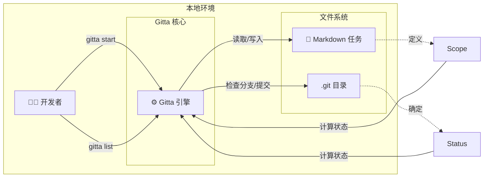
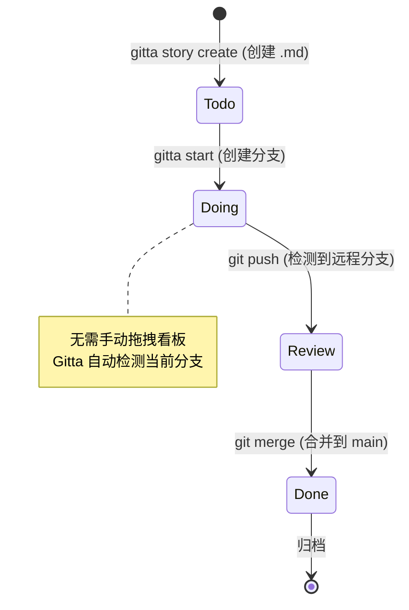

```text
  ____ _ _   _          
 / ___(_) |_| |_ __ _   
| |  _| | __| __/ _` |  
| |_| | | |_| || (_| |  
 \____|_|\__|\__\__,_|  Git Task Assistant
```
<div align="center">

你的任务就在你的代码所在之处。面向极客的本地优先、Git 原生的敏捷工具。

</div>

[English](README.md) | [中文](README.zh-CN.md)

[](https://github.com/GavinWu1991/gitta/actions/workflows/ci.yml)
[](LICENSE)
[](go.mod)

---

## 核心演示


观看 Gitta 的实际操作：创建任务、开始工作，状态会根据你的 Git 工作流自动更新。

---

## 架构



Gitta 作为 Markdown 任务文件和 Git 仓库状态之间的桥梁，自动从分支操作推导任务状态。

---

## 工作流



任务状态随 Git 操作自动流转——无需手动更新。

---

## 使用场景

### "沉浸式"模式

你想在不离开终端的情况下修复一个 bug。

```bash
$ gitta story create --title "修复用户服务中的空指针异常"
$ gitta start US-001
```

🚀 分支已创建。上下文已切换。立即开始编码。

### "站会"模式

你需要回答"昨天做了什么？"

```bash
$ gitta list --all
```

📋 查看所有任务及其当前状态，状态自动从 Git 分支状态推导。

---

## 目录

- [核心演示](#核心演示)
- [架构](#架构)
- [工作流](#工作流)
- [使用场景](#使用场景)
  - ["沉浸式"模式](#沉浸式模式)
  - ["站会"模式](#站会模式)
- [目录](#目录)
- [Gitta 是什么？](#gitta-是什么)
  - [功能](#功能)
- [快速开始](#快速开始)
  - [先决条件](#先决条件)
  - [下载预构建二进制](#下载预构建二进制)
  - [安装](#安装)
  - [一行安装 + 初始化（自动下载 + init 脚本）](#一行安装--初始化自动下载--init-脚本)
  - [构建](#构建)
  - [首次命令](#首次命令)
- [可用命令](#可用命令)
  - [快速示例](#快速示例)
- [常见工作流](#常见工作流)
  - [入门流程（安装 → 列表 → 开始 → 验证）](#入门流程安装--列表--开始--验证)
  - [日常流程（更新 → 列表 → 开始/继续 → 提交）](#日常流程更新--列表--开始继续--提交)
  - [Sprint 规划（Sprint 与 backlog）](#sprint-规划sprint-与-backlog)
  - [Sprint 管理](#sprint-管理)
- [架构](#架构-1)
- [开发](#开发)
  - [项目结构](#项目结构)
  - [测试](#测试)
  - [新增命令](#新增命令)
- [贡献](#贡献)
- [文档](#文档)
- [支持](#支持)
- [许可证](#许可证)

---

## Gitta 是什么？

Gitta 是一款 Git 任务助手，把任务存成带 YAML Frontmatter 的 Markdown，并用 Git 分支推导状态。无需服务器或外部服务，只要有 Git 就能工作。

### 功能

- **零基础设施**：无须部署任何服务，开箱即用。
- **Git 原生**：任务保存在仓库的 Markdown 文件中。
- **分支感知**：分支状态自动驱动任务状态。
- **Sprint 管理**：通过时间限定的 Sprint 组织任务，支持燃尽图。
- **可视化状态指示器**：Sprint 状态通过文件夹名称前缀显示（! 活跃，+ 就绪，@ 规划中，~ 已归档），在文件管理器中自动排序。
- **自我修复**：`doctor` 命令检测并修复可视化指示器和状态文件之间的不一致。
- **命令行优先**：快速 CLI 流程，支持交互式 TUI 任务选择。
- **离线优先**：设置后完全离线工作。

---

## 快速开始

### 先决条件

- Go 1.21 或更高
- Git
- Make（可选，用于开发）

### 下载预构建二进制

> 推荐：最快 2 分钟即可运行，无需 Go 环境。

1. 访问 GitHub Releases：选择需要的版本  
2. 下载适合平台的压缩包：  
   - macOS：`gitta-<version>-darwin-amd64.tar.gz`（Intel）或 `darwin-arm64.tar.gz`（Apple Silicon）  
   - Linux：`gitta-<version>-linux-amd64.tar.gz` 或 `linux-arm64.tar.gz`  
   - Windows：`gitta-<version>-windows-amd64.zip` 或 `windows-amd64.zip`
3. 校验完整性（推荐）：  
   ```bash
   shasum -a 256 gitta-<version>-<platform>-<arch>.tar.gz
   # 或使用 checksums.txt 中的值比对
   ```
4. 解压并添加到 PATH：  
   ```bash
   tar -xzf gitta-<version>-darwin-amd64.tar.gz   # macOS/Linux
   unzip gitta-<version>-windows-amd64.zip        # Windows
   sudo mv gitta /usr/local/bin/                  # 可选
   gitta --help
   ```

### 安装

```bash
# 克隆仓库
git clone https://github.com/GavinWu1991/gitta.git
cd gitta

# 安装依赖
go mod tidy

# 验证安装
make verify  # 运行全部检查
```

### 一行安装 + 初始化（自动下载 + init 脚本）

```bash
curl -sSf https://raw.githubusercontent.com/GavinWu1991/gitta/main/scripts/remote-init.sh | bash
# 强制重建或自定义 Sprint 名：
curl -sSf https://raw.githubusercontent.com/GavinWu1991/gitta/main/scripts/remote-init.sh | bash -s -- --force --example-sprint Sprint-02
```

### 构建

```bash
# 构建二进制
go build -o gitta ./cmd/gitta

# 验证可用
./gitta --help
./gitta version
```

### 首次命令

```bash
# 初始化工作区（创建 sprints/backlog + 示例）
gitta init

# 查看当前 Sprint 任务
gitta list

# 同时查看 Sprint + backlog
gitta list --all

# 开始一个任务
gitta start US-001

# 创建新故事
gitta story create --title "实现功能 X"

# 更新故事状态
gitta story status US-001 --status doing

# 移动故事到 sprint
gitta story move US-001 --to sprints/2025-01/

# 使用过滤器列表
gitta list --status doing --priority high

# 查看版本
gitta version
```

---

## 可用命令

| 命令 | 描述 | 基本用法 | 文档 |
|------|------|----------|------|
| `gitta init` | 使用示例任务初始化 gitta 工作区 | `gitta init [--force] [--example-sprint <name>]` | [docs/cli/init.md](docs/cli/init.md) |
| `gitta list` | 显示当前 Sprint 任务；`--all` 包含 backlog；支持过滤 | `gitta list [--all] [--status <status>] [--priority <priority>]` | [docs/cli/list.md](docs/cli/list.md) |
| `gitta sprint start` | 创建并激活新 sprint，或激活现有 sprint | `gitta sprint start [sprint-id] [--duration <duration>]` | [docs/cli/sprint.md](docs/cli/sprint.md) |
| `gitta sprint plan` | 为未来工作创建新的规划 sprint | `gitta sprint plan <name> [--id <id>]` | [docs/cli/sprint.md](docs/cli/sprint.md) |
| `gitta sprint close` | 关闭 sprint 并回滚未完成任务 | `gitta sprint close [--target-sprint <name>] [--all]` | [docs/cli/sprint.md](docs/cli/sprint.md) |
| `gitta sprint burndown` | 从 Git 历史生成燃尽图 | `gitta sprint burndown [name] [--format <format>]` | [docs/cli/sprint.md](docs/cli/sprint.md) |
| `gitta doctor` | 检测并修复 sprint 状态不一致 | `gitta doctor [--fix] [--sprint <name>]` | [docs/cli/sprint.md](docs/cli/sprint.md) |
| `gitta start` | 为任务创建/检出功能分支，可选设置 assignee | `gitta start <task-id|file-path> [--assignee <name>]` | [docs/cli/start.md](docs/cli/start.md) |
| `gitta story create` | 创建具有唯一 ID 的新故事并打开编辑器 | `gitta story create --title "Title" [--prefix US]` | [docs/cli/create.md](docs/cli/create.md) |
| `gitta story status` | 原子性更新故事状态 | `gitta story status <story-id> --status <status>` | [docs/cli/status.md](docs/cli/status.md) |
| `gitta story move` | 原子性移动故事文件到不同目录 | `gitta story move <story-id> --to <dir>` | [docs/cli/move.md](docs/cli/move.md) |
| `gitta version` | 报告构建元数据（semver、提交、构建日期、Go 版本） | `gitta version [--json]` | [docs/cli/version.md](docs/cli/version.md) |

### 快速示例

```bash
# 仅 Sprint
gitta list

# Sprint + backlog
gitta list --all

# 通过任务 ID 开始
gitta start US-001

# 通过文件路径开始
gitta start sprints/Sprint-01/US-001.md

# JSON 版本信息
gitta version --json
```

---

## 常见工作流

### 入门流程（安装 → 列表 → 开始 → 验证）
1) 按"快速开始"安装和构建  
2) 查看 Sprint：`gitta list`  
3) 开始任务：`gitta start US-001`  
4) 验证：检查当前分支与任务 frontmatter

### 日常流程（更新 → 列表 → 开始/继续 → 提交）
1) 更新代码：`git pull`  
2) 查看 Sprint：`gitta list`  
3) 开始或继续：`gitta start <task-id>`  
4) 随进度提交/推送；分支代表状态

### Sprint 规划（Sprint 与 backlog）
1) Sprint 列表：`gitta list`  
2) Sprint + backlog：`gitta list --all`  
3) 调整任务：通过移动 Markdown 位置管理 Sprint/backlog，执行 `gitta list --all` 验证

### Sprint 管理
1) 开始新 sprint：`gitta sprint start`（自动生成 Sprint-01、Sprint-02 等）
2) 规划未来 sprint：`gitta sprint plan "仪表板重设计"`（创建带 @ 前缀的规划 sprint）
3) 激活现有 sprint：`gitta sprint start 24`（按 ID 激活 sprint，归档当前活跃的）
4) 关闭 sprint 并回滚任务：`gitta sprint close --target-sprint Sprint-02`
5) 查看燃尽图：`gitta sprint burndown`（分析 Git 历史）
6) 检查状态一致性：`gitta doctor`（检测文件夹名称和状态文件之间的不一致）
7) 修复不一致：`gitta doctor --fix`（自动修复检测到的问题）

**Sprint 状态指示器：**
- `!` **活跃** - 当前活跃的 sprint（在文件管理器中显示在顶部）
- `+` **就绪** - 准备激活的 sprint
- `@` **规划中** - 规划阶段的未来 sprint
- `~` **已归档** - 已完成的 sprint（显示在底部）

Sprint 文件夹在文件管理器中按状态前缀自动排序，提供可视化组织。

---

## 架构

六边形架构（端口-适配器）：
- **领域**：`internal/core`，`internal/services`
- **适配器**：`cmd/`（CLI），`infra/`（Git/文件系统），`ui/`（未来 TUI）
- **共享**：`pkg/` 工具库

详见 [docs/architecture.md](docs/architecture.md)。

---

## 开发

### 项目结构

```
cmd/gitta/          # CLI（Cobra）
internal/           # 领域逻辑
  core/             # 接口
  services/         # 实现
infra/              # Git、文件系统适配器
pkg/                # 工具库
tools/              # 开发工具
docs/               # 文档
```

### 测试

```bash
go test ./...
make verify  # 包含测试与 lint
```

### 新增命令

1) 创建命令文件：`cmd/gitta/<command>.go`  
2) 在 `cmd/gitta/root.go` 注册  
3) 在 `internal/services/` 实现服务  
4) 在 `docs/cli/<command>.md` 补充文档

更多见 `cmd/README.md`。

---

## 贡献

- 设置并验证：`go mod tidy && make verify`
- 遵循六边形边界（业务逻辑不放在 `cmd/`）
- 非 trivial 逻辑采用表驱动测试，CLI 流程补充集成测试
- 提 PR 时关联对应的 spec/plan，说明修改范围
- 架构参考： [docs/architecture.md](docs/architecture.md)  
- 命令参考： [cmd/README.md](cmd/README.md)

---

## 文档

- [架构指南](docs/architecture.md)
- [CLI 参考](docs/cli/)
- [快速开始](docs/quickstart.md)

---

## 支持

- 问题反馈：在 GitHub 提 issue，附带复现步骤和 CLI 输出
- 排查：重新运行 `gitta list --all` 检查任务位置和状态

---

## 许可证

使用 [MIT 许可证](LICENSE)。
